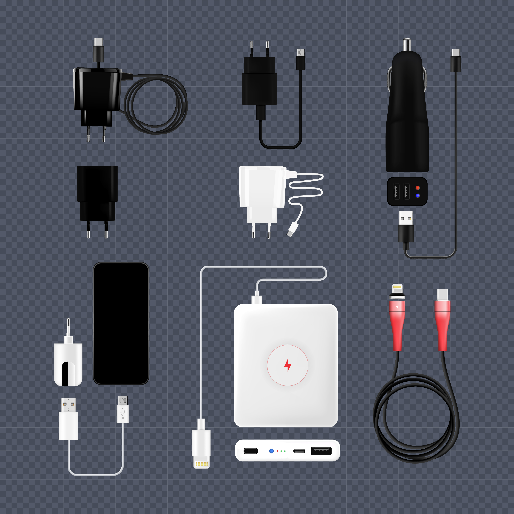
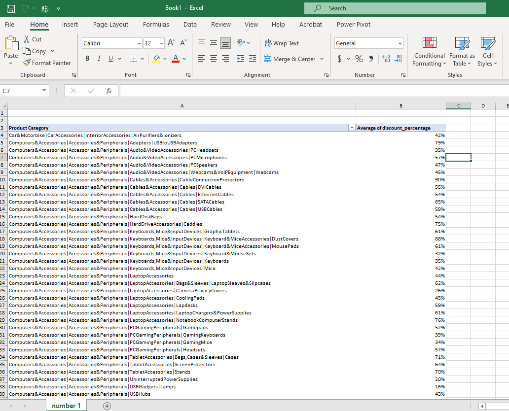
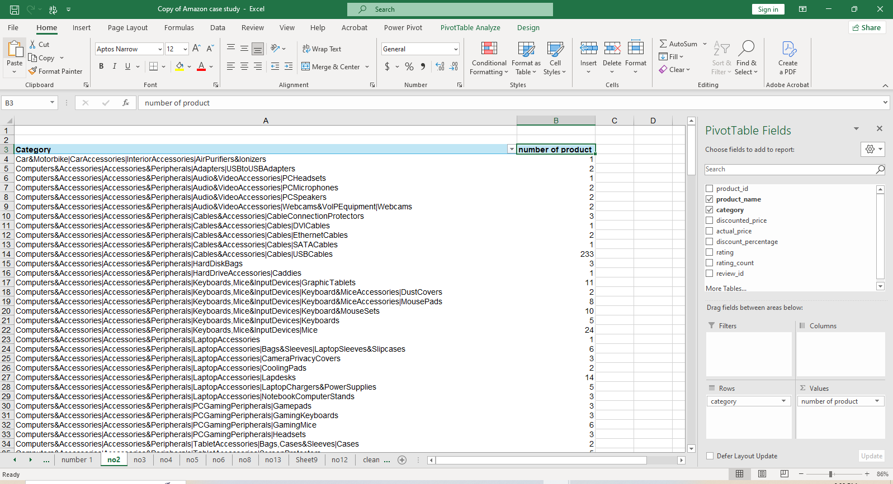
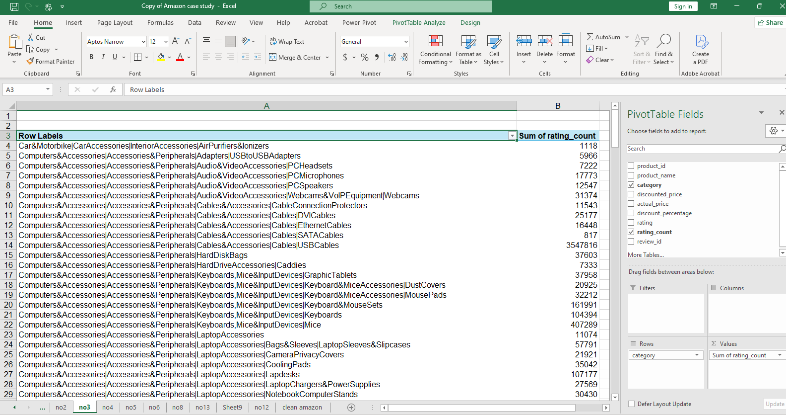
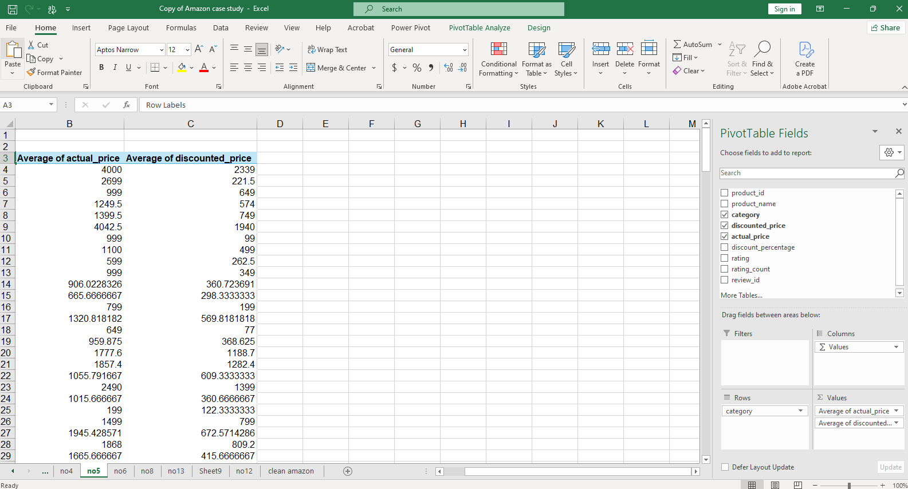
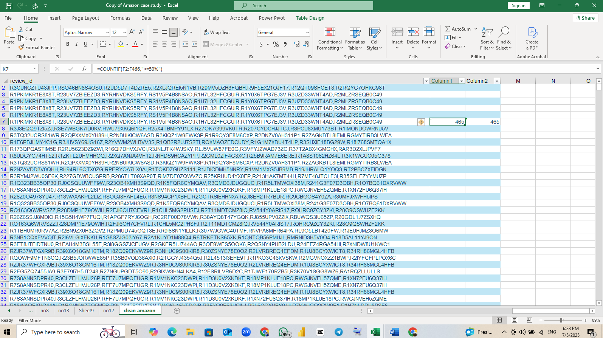
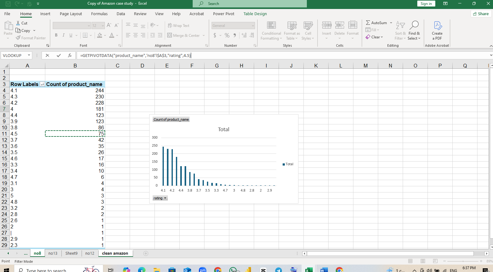

# USB-and-Lightning-cable-product-analysis

# 📊 USB & Lightning Cables Product Analysis

## Table of Content

- [Introduction](#Introduction)
- [Project Overview](#Project-Overview)
- [Data source](#Data-source)
- [Tools used](#Tools-used)
- [Data Analysis](#Data-Analysis)
- [Visualisations](#Visualisations)
- [Key Insights](Key-Insights)
- [Recommendations](#Recommendations)
- [Conclusion](#Conclusion)

  
## Introduction
This project focuses on analyzing Amazon product data for various USB and Lightning charging cables. The goal is to derive insights into pricing strategies, customer preferences, product performance, and user reviews to inform decision-making for manufacturers, marketers, or retailers.

## Project Overview

This analysis includes:
- Cleaning and preprocessing raw data
- Creating calculated fields
- Visualizing trends and distributions using Pivot Tables
- Deriving actionable business insights
- Making data-driven recommendations

## Data Source

- Source: Product listing and review data were given by DSA
- Format: Structured table with fields such as:
  - `product_id`, `product_name`, `category`, `discounted_price`, `actual_price`, `discount_percentage`, `rating`, `rating_count`, `about_product`, `user_reviews`, and media/product links.

## Tools used
- Microsoft Excel
- Pivot Tables
- Calculated Columns
- Markdown for documentation

  

## Data Analysis 

### 1. Data Cleaning
- Removed blanks
- Checked for duplicate values
- Removed redundant columns
- Converted the dataset to a table

  
### 2. Calculated Columns
- `potential_revenue = actual_price * rating_count`

### 3. Pivot Table Analysis

#### Q1: Average Discount % by Category
Grouped products by category and calculated average discount by dragging category to rows and discount_percentage to values

#### Q2: Product Count by Category
Counted distinct products under each product category by dragging category to rows and product to values

#### Q3: Total Reviews per Category
Summed `rating_count` per category to identify engagement levels by dragging category to rows and rating count to values

#### Q4: Products with Highest Ratings
Ranked products by `rating`, filtering for top performers by dragging product me to rows and rating to values, the sort from largest to smallest

The top products with highest verge ratings are:

Syncwire LTG to USB Cable for Fast Charging Compatible with Phone 5/ 5C/ 5S/ 6/ 6S/ 7/8/ X/XR/XS Max/ 11/12/ 13 Series and Pad Air/Mini, Pod & Other Devices (1.1 Meter, White)

REDTECH USB-C to Lightning Cable 3.3FT, [Apple MFi Certified] Lightning to Type C Fast Charging Cord Compatible with iPhone 14/13/13 pro/Max/12/11/X/XS/XR/8, Supports Power Delivery - White

Amazon Basics Wireless Mouse | 2.4 GHz Connection, 1600 DPI | Type - C Adapter | Upto 12 Months of Battery Life | Ambidextrous Design | Suitable for PC/Mac/Laptop

#### Q5: Average Price Comparison by Category
Compared average `actual_price` vs `discounted_price` to evaluate pricing strategy by dragging Category to rows and actual and discouted price to values. Then, the field setting is changed to average

#### Q6: Products with Most Reviews
Identified highly reviewed (popular) products by dragging product name to rows and rating count to values. The sum is found automatically.

The answer is
AmazonBasics Flexible Premium HDMI Cable (Black, 4K@60Hz, 18Gbps), 3-Foot

#### Q7: Products with ≥50% Discount
Used conditional filter to count high-discounted items by using the formular =COUNTIF(F2:F466,">=50%")

The answer is 465 products had  discount of greater than or equal to 50%

#### Q8: Rating Distribution
Grouped products by `rating` and counted frequency by dragging rating to rows and product name to value(count)

#### Q9: Potential Revenue by Category
Calculated potential revenue using `actual_price * rating_count`.

#### Q10: Products per Price Range
Bucketed prices into ranges to see where most products fall.

#### Q11: Correlation Between Rating and Discount
Visualized `rating` vs `discount_percentage` using scatter plot.

#### Q12: Products with <1000 Reviews
Flagged and counted low-engagement products.

#### Q13: Max Discounts by Category
Identified categories offering highest individual discounts.

#### Q14: Top 5 Products by Weighted Score
Used formula: `rating * LOG10(rating_count + 1)` to balance quality and quantity.

## Visualisations

## Key Insights

- **Cables under ₹500 dominate** the market, especially from brands like pTron and Ambrane.
- **Discounts of 60–90%** are common and play a key role in consumer choice.
- **Rating does not strongly correlate** with discount percentage.
- Products with high ratings often come with robust reviews and warranty promises.
- Some categories consistently outperform others in both **reviews and revenue potential**.

## Recommendations

- **Bundle high-performing cables** into multipacks and promote them via review-based ads.
- **Improve documentation and product clarity** for low-rated items.
- **Invest in higher discount marketing strategies** for newer, low-reviewed products.
- **Track review quality, not just quantity**, as some reviews mention quality defects despite high counts.

## Conclusion

This project demonstrates how structured analysis of e-commerce product data can reveal powerful insights into product positioning, consumer perception, and pricing dynamics. With the help of Excel Pivot Tables and calculated columns, we were able to transform raw listing data into strategic intelligence.

### Back to top 
###### [Table of Content](#Table-of-Content)

